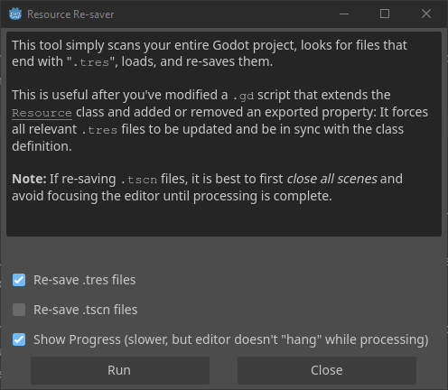

# Resource Resaver Tool

The Resource Resaver is a small Godot addon that automatically re-saves all `.tres` resource files in your project.
It's designed to keep your serialized resource files up-to-date after making changes to the associated `.gd` resource scripts.

The tool can be invoked from the `Project` menu. Select `Tools`, `Re-save Resources...`:

## The Problem It Solves

Godot resources are made up of:

- A resource class (the `.gd` script extending `Resource`)
- One or more serialized resource files (the `.tres` file) saved to disk

When you update a resource script (a `.gd` file that extends `Resource`), Godot does not automatically update the `.tres` files that depend on it, unless you open and save them manually in the editor.
This can lead to inconsistencies in the on-disk representation of your resources, especially in larger, data-driven projects.

While these outdated `.tres` files will still work at runtime, they can cause version control issues in team environments:

- Outdated resources may appear as modified unexpectedly.
- Merge conflicts can occur if teammates unknowingly edit resources missing recent changes.

This addon solves that by re-saving all `.tres` files in bulk, ensuring they match the current definition of their associated scripts.

In collaborative projects, this avoids confusing diffs and merge conflicts when someone unknowingly edits an outdated resource and prevents inconsistencies from surfacing later in development.

## Installation

1. Add the `gg_resource_resaver` addon into your `addons/` directory.
2. Enable the plugin from `Project`, `Project Settings`, `Plugins`.

## Usage

Navigate to `Project`, `Tools`, `Re-save Resources...` to open the tool and press the `Run` button.

## Acknowledgements

This tool was created in response to [this Reddit post](https://www.reddit.com/r/godot/comments/1j98gje/is_there_any_way_to_update_all_resources_of_a/), which also outlines the real-world problem it helps solve.
